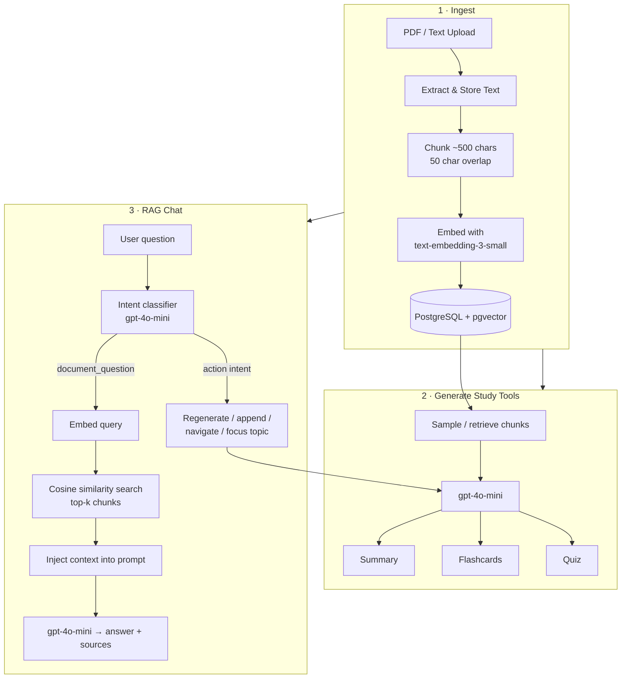

# StudyAI

**[🚀 Live Demo](https://studyai.vercel.app)** · [Backend API](https://studyai-api.onrender.com/api/health)

> Replace the links above with your deployed Vercel and Render URLs after publishing.

Turn any document into a complete study session — summaries, flashcards, quizzes, and a RAG-powered chat assistant grounded in your material.

## Demo

[](https://www.loom.com/share/YOUR_VIDEO_ID)

> Record a ~30s walkthrough with [Loom](https://www.loom.com) or QuickTime, paste your share link above, and optionally add a GIF:
>
> ```markdown
> 
> ```

---

## Built With


---

## Features

- ✅ **PDF upload & text paste** — extract content from PDFs or paste notes directly
- ✅ **One-click sample document** — recruiters can try the app instantly without a PDF
- ✅ **AI summary** — 2–3 paragraph overview with key concept pills and copy-to-clipboard
- ✅ **Smart flashcards** — auto-generated deck with flip animation and export to PDF
- ✅ **Mastery tracking** — mark cards "I knew this" / "Still learning" with progress bar and weak-card review mode
- ✅ **Adaptive quiz** — multiple-choice and true/false questions with explanations
- ✅ **Quiz results dashboard** — letter grade (A–F), topic breakdown, and exportable results PDF
- ✅ **Study weak topics** — auto-generate flashcards from questions you missed
- ✅ **RAG document chat** — ask anything about your material with cited source chunks
- ✅ **Intent-aware chat actions** — regenerate or append flashcards/quiz, change difficulty/format, focus on a topic, or navigate tabs via natural language
- ✅ **Large document support** — even chunk sampling up to 80k characters with coverage indicators
- ✅ **Dynamic generation** — configurable count, difficulty (easy/medium/hard), format, and topic filters
- ✅ **Document history** — last 5 uploads saved with filename and date for quick re-access
- ✅ **Polished loading UX** — skeleton loaders and typewriter status messages while AI generates
- ✅ **Mobile responsive** — works on phone screens for tabs, flashcards, quiz, and chat
- ✅ **Production-ready deployment** — Render backend + Vercel frontend

---

## How It Works

StudyAI uses a **Retrieval-Augmented Generation (RAG)** pipeline so chat answers stay grounded in your uploaded document instead of hallucinating.



### Pipeline steps

| Step | What happens |
|------|--------------|
| **Upload** | PDF text is extracted (PyMuPDF) or pasted text is accepted. Full text is stored in memory; metadata (filename, char count, chunk count) is saved to PostgreSQL. |
| **Chunk & embed** | Text is split into ~500-character overlapping chunks. Each chunk is embedded with OpenAI `text-embedding-3-small` (1536 dimensions) and stored in `document_chunks` with pgvector. |
| **Generate** | Summary, flashcards, and quiz are created by sampling document chunks (up to 80k chars) and sending them to `gpt-4o-mini` with structured JSON prompts. Count scales with document size. |
| **RAG retrieval** | Chat questions are embedded and compared against stored chunks using pgvector cosine distance (`<=>`). Top matches become the LLM context. |
| **Intent routing** | Non-question messages (e.g. "add 5 more flashcards", "make the quiz harder") are classified into structured actions that trigger regeneration, appends, or tab navigation — never mixing flashcards and quiz. |

### API overview

```
POST /api/upload        → chunk, embed, index document
POST /api/demo          → load bundled sample article
POST /api/generate      → summary | flashcards | quiz
POST /api/chat          → RAG Q&A + intent actions
POST /api/documents/lookup → recent document metadata
GET  /api/health        → health check
```

---

## Local Setup

### Prerequisites

- Python 3.11+
- Node.js 18+
- PostgreSQL with the [pgvector](https://github.com/pgvector/pgvector) extension (Neon, Supabase, or local)

> **macOS users:** Disable **AirPlay Receiver** in System Settings → General → AirDrop & Handoff before running the backend, as it occupies port 5000 by default.

### Backend

```bash
cd backend
python3 -m venv .venv
source .venv/bin/activate        # Windows: .venv\Scripts\activate
pip install -r requirements.txt
cp .env.example .env             # fill in your values
python app.py                    # schema is applied automatically on first request
```

The API runs at `http://localhost:5000` (falls back to 5001+ if 5000 is taken).

### Frontend

```bash
cd frontend
npm install
cp .env.example .env             # set VITE_API_URL=http://localhost:5000
npm run dev
```

The app runs at `http://localhost:5173`.

---

## Environment Variables

### Backend (`backend/.env`)

| Variable | Description |
|----------|-------------|
| `OPENAI_API_KEY` | OpenAI API key |
| `DATABASE_URL` | PostgreSQL connection string (with pgvector enabled) |
| `CORS_ORIGINS` | Comma-separated allowed frontend origins (default: `http://localhost:5173`) |
| `PORT` | Server port (set automatically on Render) |

### Frontend (`frontend/.env`)

| Variable | Description |
|----------|-------------|
| `VITE_API_URL` | Backend base URL, e.g. `https://your-app.onrender.com` |

---

## Deployment

### Backend (Render)

1. Create a **Web Service** pointing to the `backend` directory.
2. Set build command: `pip install -r requirements.txt`
3. Start command (from Procfile): `gunicorn app:app`
4. Add environment variables: `OPENAI_API_KEY`, `DATABASE_URL`, `CORS_ORIGINS` (your Vercel URL).
5. Use a PostgreSQL instance with pgvector (e.g. Neon or Supabase).

Health check: `GET /api/health` → `{ "status": "ok" }`

### Frontend (Vercel)

1. Import the repo and set the root directory to `frontend`.
2. Add `VITE_API_URL` pointing to your Render backend URL.
3. Deploy — then update the **Live Demo** link at the top of this README.

### Adding your demo video

1. Record a ~30 second walkthrough with [Loom](https://www.loom.com) or QuickTime (upload → sample doc → flashcards → quiz → chat).
2. Replace `YOUR_VIDEO_ID` in the demo link above with your Loom share URL.
3. Optionally export a GIF with [ScreenToGif](https://www.screentogif.com/) or `ffmpeg` and commit it to `docs/demo.gif`, then embed it:

   ```markdown
   
   ```

---

## Project Structure

```
StudyAI/
├── backend/
│   ├── app.py              # Flask entry point
│   ├── Procfile            # Render start command
│   ├── assets/             # Bundled demo article
│   ├── requirements.txt
│   ├── routes/             # upload, generate, chat, documents, demo
│   ├── services/           # RAG, generation, chat, document history
│   └── sql/schema.sql      # pgvector + documents tables
└── frontend/
    ├── src/
    │   ├── api/            # API client (uses VITE_API_URL)
    │   ├── components/     # Tabs, skeletons, toasts
    │   ├── pages/          # Landing and Study pages
    │   └── utils/          # Chat actions, quiz helpers, history
    └── .env.example
```

---

## License

MIT
